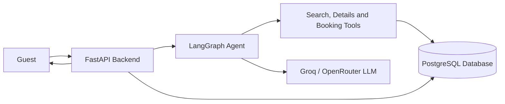

# StayEase Booking Agent

## 1. Architecture Document

### AI Assistance Note

Claude and ChatGPT were used as helper tools in this assessment to complete the work in a short time. The main project idea, system direction, database choice, agent flow, and final decisions were planned by me. These AI tools were used as coding assistants to help write the Python skeleton, improve the documentation, check the logic, and verify the API and database behavior. The final review, testing through Postman, and submission decisions were done by me.

### 1.1 System Overview

StayEase is a short-term accommodation rental platform for guests in Bangladesh. In this project, a simple booking agent is designed to help guests search available properties, see property details, and confirm bookings. The FastAPI backend receives the guest message and sends it to the LangGraph agent. The agent uses tools to read or write data from the PostgreSQL database. The language model is used for understanding the guest message and preparing a polite response. The architecture can use Groq or OpenRouter as requested in the task, and this repository uses Gemini in the code because the available API key is Gemini.



### 1.2 Conversation Flow

Example guest message:

```text
I need a room in Cox's Bazar for 2 nights for 2 guests.
```

Step by step flow:

1. The guest sends the message to `POST /api/chat/{conversation_id}/message`.
2. The FastAPI backend receives the message and loads the previous messages for this conversation.
3. The message is passed to the LangGraph agent with the conversation id.
4. The `classify_intent` node checks the latest message and marks the intent as `search`.
5. The `call_llm` node sends the conversation to the LLM with the StayEase tools.
6. The LLM selects the `search_available_properties` tool because the guest asked for a room.
7. The `execute_tool` node runs the search query against PostgreSQL.
8. The database returns active listings in Cox's Bazar that can support 2 guests and are not booked for those dates.
9. The `respond` node prepares the final reply for the guest.
10. The backend stores the assistant reply and sends the response back to the guest.

Example final answer:

```text
Hello! I found 2 available stays in Cox's Bazar for 2 guests.

1. Sea Breeze Villa - BDT 4,500 per night
2. Ocean View Resort - BDT 6,200 per night
```

### 1.3 LangGraph State Design

| Field | Type | Why it is needed |
| --- | --- | --- |
| `messages` | `list[BaseMessage]` | Stores guest, assistant, and tool messages for the current conversation. |
| `conversation_id` | `str` | Keeps the graph connected with the saved conversation in the database. |
| `current_intent` | `str` | Stores the current task such as search, details, book, or escalate. |
| `tool_results` | `dict[str, Any]` | Keeps the latest tool output before the final reply is written. |
| `needs_escalation` | `bool` | Shows whether the request should be transferred to a human. |

### 1.4 Node Design

| Node | What it does | What it updates in state | Next node |
| --- | --- | --- | --- |
| `classify_intent` | Reads the latest guest message and finds the intent. | `current_intent`, `needs_escalation` | `call_llm` or `escalate` |
| `call_llm` | Sends the messages to the LLM and allows tool calling. | `messages` | `execute_tool` or end |
| `execute_tool` | Runs the tool requested by the LLM. | `messages`, `tool_results` | `respond` |
| `respond` | Creates the final user-facing answer. | `messages` | end |
| `escalate` | Gives a polite handoff message for unsupported requests. | `messages` | end |

### 1.5 Tool Definitions

#### `search_available_properties`

This tool is used when the guest wants to search for a property by location, dates, and number of guests.

Input parameters:

| Name | Type | Description |
| --- | --- | --- |
| `location` | `str` | City or area in Bangladesh, for example Cox's Bazar. |
| `check_in` | `date` | Check-in date. |
| `check_out` | `date` | Check-out date. |
| `guests` | `int` | Number of guests. |

Output format:

```json
[
  {
    "listing_id": "LST-001",
    "title": "Sea Breeze Villa",
    "location": "Cox's Bazar",
    "price_per_night": 4500,
    "currency": "BDT",
    "max_guests": 4,
    "rating": 4.8
  }
]
```

#### `get_listing_details`

This tool is used when the guest asks about a selected property.

Input parameters:

| Name | Type | Description |
| --- | --- | --- |
| `listing_id` | `str` | The id of the selected listing. |

Output format:

```json
{
  "listing_id": "LST-001",
  "title": "Sea Breeze Villa",
  "description": "Beachfront villa in Cox's Bazar with sea views and modern amenities.",
  "location": "Cox's Bazar",
  "price_per_night": 4500,
  "currency": "BDT",
  "amenities": ["Wi-Fi", "AC", "Kitchen"]
}
```

#### `create_booking`

This tool is used only after the guest confirms that they want to book a listing.

Input parameters:

| Name | Type | Description |
| --- | --- | --- |
| `listing_id` | `str` | The listing selected by the guest. |
| `guest_name` | `str` | Full name of the guest. |
| `check_in` | `date` | Check-in date. |
| `check_out` | `date` | Check-out date. |
| `guests` | `int` | Number of guests. |

Output format:

```json
{
  "booking_id": "BKG-20260427-001",
  "listing_id": "LST-001",
  "guest_name": "Nusrat Jahan",
  "check_in": "2026-05-10",
  "check_out": "2026-05-12",
  "guests": 2,
  "nights": 2,
  "total_price": 9000,
  "currency": "BDT",
  "status": "confirmed"
}
```

### 1.6 Database Schema Design

Only three main tables are used for this project: `listings`, `bookings`, and `conversations`.

#### `listings`

| Column | Type |
| --- | --- |
| `id` | `varchar primary key` |
| `title` | `varchar(150) not null` |
| `description` | `text` |
| `location` | `varchar(120) not null` |
| `price_per_night` | `numeric not null` |
| `max_guests` | `integer not null` |
| `bedrooms` | `integer` |
| `bathrooms` | `integer` |
| `amenities` | `text[]` |
| `rating` | `numeric(2,1)` |
| `total_reviews` | `integer default 0` |
| `host_name` | `varchar(120)` |
| `cancellation_policy` | `varchar(255)` |
| `is_active` | `boolean not null default true` |
| `created_at` | `timestamptz not null default now()` |

Indexes used for faster search:

```sql
CREATE INDEX idx_listings_location_active_guests
ON listings (lower(location), is_active, max_guests);

CREATE INDEX idx_listings_id_active
ON listings (id, is_active);
```

#### `bookings`

| Column | Type |
| --- | --- |
| `id` | `varchar primary key` |
| `listing_id` | `varchar references listings(id)` |
| `conversation_id` | `varchar references conversations(id)` |
| `guest_name` | `varchar(120) not null` |
| `check_in` | `date not null` |
| `check_out` | `date not null` |
| `guests` | `integer not null` |
| `total_price` | `numeric not null` |
| `status` | `varchar(30) not null` |
| `created_at` | `timestamptz not null default now()` |

Index used for checking date overlap:

```sql
CREATE INDEX idx_bookings_listing_dates_status
ON bookings (listing_id, check_in, check_out, status);
```

#### `conversations`

| Column | Type |
| --- | --- |
| `id` | `varchar primary key` |
| `messages` | `jsonb not null default '[]'` |
| `current_intent` | `varchar(30)` |
| `needs_escalation` | `boolean not null default false` |
| `created_at` | `timestamptz not null default now()` |
| `updated_at` | `timestamptz not null default now()` |
