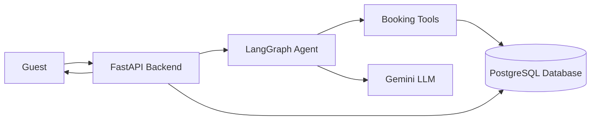

# StayEase AI Agent

## 1. Architecture Document

### 1.1 System Overview

StayEase AI is a booking assistant for a short-term accommodation rental platform in Bangladesh. Guests can ask the agent to search for properties, view listing details, and create bookings. A FastAPI backend receives chat messages, sends them to a LangGraph agent, stores conversation and booking data in PostgreSQL, and uses the Gemini LLM for natural language understanding and tool calling.



### 1.2 Conversation Flow

1. Guest sends: "I need a room in Cox's Bazar for 2 nights for 2 guests."
2. FastAPI receives the message at `POST /api/chat/{conversation_id}/message`.
3. FastAPI loads the previous conversation messages from PostgreSQL.
4. The LangGraph agent stores the new guest message in state.
5. The `classify_intent` node identifies the request as `search`.
6. The `call_llm` node asks the LLM to decide the next action.
7. The LLM calls `search_available_properties` with location, dates, and guests.
8. The `execute_tool` node queries available listings from PostgreSQL.
9. The `respond` node formats the results for the guest.
10. The backend stores the assistant reply and returns available properties with BDT prices.

Example response:

```text
Hello! I found 2 available stays in Cox's Bazar for 2 guests:

1. Sea Breeze Villa - BDT 4,500 per night
2. Ocean View Resort - BDT 6,200 per night
```

### 1.3 LangGraph State Design

| Field | Type | Why it is needed |
| --- | --- | --- |
| `messages` | `list[BaseMessage]` | Keeps the full chat history for the LLM and tool responses. |
| `conversation_id` | `str` | Connects the graph run to a stored conversation. |
| `current_intent` | `str` | Stores whether the guest wants search, details, book, or escalation. |
| `tool_results` | `dict[str, Any]` | Stores the latest tool output before the final response. |
| `needs_escalation` | `bool` | Marks unsupported requests that should go to a human. |

### 1.4 Node Design

| Node | What it does | State updates | Next node |
| --- | --- | --- | --- |
| `classify_intent` | Reads the latest guest message and classifies it. | `current_intent`, `needs_escalation` | `call_llm` or `escalate` |
| `call_llm` | Sends the conversation to the LLM with tools attached. | `messages` | `execute_tool` or end |
| `execute_tool` | Runs the selected booking tool. | `messages`, `tool_results` | `respond` |
| `respond` | Uses the LLM to write a guest-friendly final answer. | `messages` | end |
| `escalate` | Creates a polite human handoff message. | `messages` | end |

### 1.5 Tool Definitions

#### `search_available_properties`

When used: The guest wants to find available properties by location, dates, and number of guests.

Input parameters:

| Name | Type | Description |
| --- | --- | --- |
| `location` | `str` | City or area in Bangladesh. |
| `check_in` | `date` | Guest check-in date. |
| `check_out` | `date` | Guest check-out date. |
| `guests` | `int` | Number of guests. |

Output format:

```json
[
  {
    "listing_id": "LST-001",
    "title": "Sea Breeze Villa",
    "location": "Cox's Bazar",
    "price_per_night": 4500,
    "currency": "BDT",
    "max_guests": 4,
    "rating": 4.8
  }
]
```

#### `get_listing_details`

When used: The guest asks about a specific property or listing ID.

Input parameters:

| Name | Type | Description |
| --- | --- | --- |
| `listing_id` | `str` | Unique listing ID. |

Output format:

```json
{
  "listing_id": "LST-001",
  "title": "Sea Breeze Villa",
  "description": "Beachfront villa in Cox's Bazar with sea views and modern amenities.",
  "price_per_night": 4500,
  "currency": "BDT",
  "amenities": ["Wi-Fi", "AC", "Kitchen"]
}
```

#### `create_booking`

When used: The guest confirms they want to book a listing.

Input parameters:

| Name | Type | Description |
| --- | --- | --- |
| `listing_id` | `str` | Listing to book. |
| `guest_name` | `str` | Full name of the guest. |
| `check_in` | `date` | Guest check-in date. |
| `check_out` | `date` | Guest check-out date. |
| `guests` | `int` | Number of guests. |

Output format:

```json
{
  "booking_id": "BKG-20260427-001",
  "listing_id": "LST-001",
  "guest_name": "Nusrat Jahan",
  "total_price": 9000,
  "currency": "BDT",
  "status": "confirmed"
}
```

### 1.6 Database Schema Design

#### `listings`

| Column | Type |
| --- | --- |
| `id` | `varchar primary key` |
| `title` | `varchar(150) not null` |
| `description` | `text` |
| `location` | `varchar(120) not null` |
| `price_per_night` | `numeric not null` |
| `max_guests` | `integer not null` |
| `bedrooms` | `integer` |
| `bathrooms` | `integer` |
| `amenities` | `text[]` |
| `rating` | `numeric(2,1)` |
| `total_reviews` | `integer default 0` |
| `host_name` | `varchar(120)` |
| `cancellation_policy` | `varchar(255)` |
| `is_active` | `boolean not null default true` |
| `created_at` | `timestamptz not null default now()` |

Recommended indexes:

```sql
CREATE INDEX idx_listings_location_active_guests
ON listings (lower(location), is_active, max_guests);

CREATE INDEX idx_listings_id_active
ON listings (id, is_active);
```

#### `bookings`

| Column | Type |
| --- | --- |
| `id` | `varchar primary key` |
| `listing_id` | `varchar references listings(id)` |
| `conversation_id` | `varchar references conversations(id)` |
| `guest_name` | `varchar(120) not null` |
| `check_in` | `date not null` |
| `check_out` | `date not null` |
| `guests` | `integer not null` |
| `total_price` | `numeric not null` |
| `status` | `varchar(30) not null` |
| `created_at` | `timestamptz not null default now()` |

Recommended index:

```sql
CREATE INDEX idx_bookings_listing_dates_status
ON bookings (listing_id, check_in, check_out, status);
```

#### `conversations`

| Column | Type |
| --- | --- |
| `id` | `varchar primary key` |
| `messages` | `jsonb not null default '[]'` |
| `current_intent` | `varchar(30)` |
| `needs_escalation` | `boolean not null default false` |
| `created_at` | `timestamptz not null default now()` |
| `updated_at` | `timestamptz not null default now()` |
